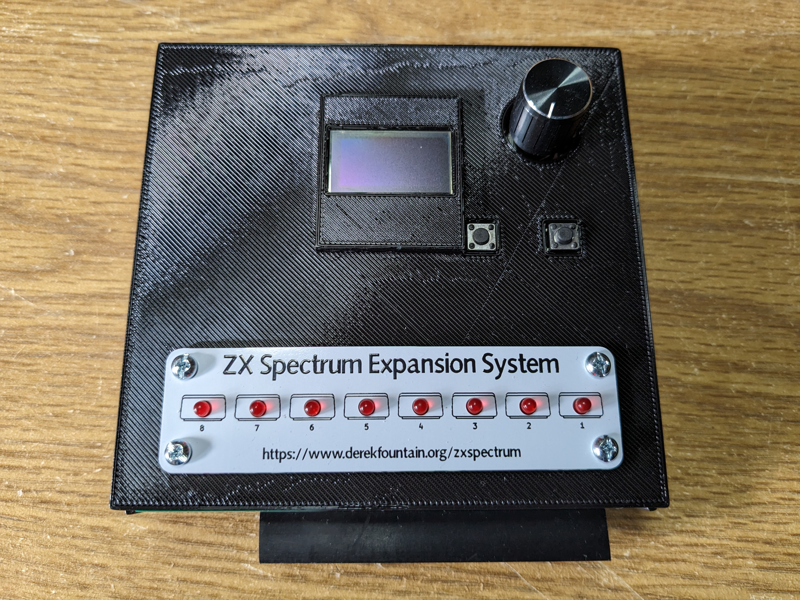

# ZX Spectrum Expansion System, Recreated

## An Interface One / Microdrive Emulation for the ZX Spectrum

This device plugs into the back of a 48K ZX Spectrum and provides the
functionality of the original 1984 "ZX Spectrum Expansion System". It
emulates a ZX Interface One with 8 ZX Microdrives.

The device is completely compatible with all 1980s software. It uses no
ROM modifications or other hacks. To my knowledge there are no
limitations or caveats to its use.

The first version is complete and supports the ZX Microdrives as
designed; the RS232 and ZX Net features of the Interface One might follow.

The project is open source, open hardware design, distributed under the
GPL licence.

There's lots more information on the [project page](https://www.derekfountain.org/zses.php)
on [my website](https://www.derekfountain.org/).

Click through for a brief demonstration:

https://www.youtube.com/watch?v=kph2aS7qcVc

## Status

As of July 2023, version 1.0 is complete:

It is functionally complete:

* Spectrum can read and write all 8 microdrives
* Uses "MDR" image format for "cartridges", fully compatible with emulators
* Full ZX Interface One ROM support, all native BASIC commands and extensions work as designed
* MDR files loaded from, and saved back to, SD card
* User interface uses file selector to choose and "insert" a cartridge
* Cartridge eject, allowing cartridges to be changed as required
* Configuration file allows auto-insertion of selected cartridges at start up

I'd be interested to receive feedback from anyone who tries to build one.

Derek Fountain, July 2023

# Operation

It should be fairly obvious. Select the Microdrive with the rotary encoder, click the right
button to bring up the file selector, use the rotary to select a cartridge file, then click the right button
again. The left button cancels.

The file selector only brings up files named *.mdr, and it doesn't do subdirectories. This
could be improved.

If you create a file in the root of your SD card called zxes_config.txt (that's not a
typo, I have an issue open to rename that file to match the rest of the project) and
enter up to 8 lines, each with a filename giving the name of an MDR file on your SD card,
those cartridge images will be loaded into the Microdrives on startup. (Startup meaning the
Pico startup, not the Spectrum start up.)

# Build Guidance

If you want to have a go at building one, please ensure you check out the open issues first.
There are a few, um, anomalies, which you might want to consider or work around. If I do
another spin of the boards I should be able to clear these up.

That said...

All my surface mount component footprints are metric 3216 sized (1206i). Those are easy to hand solder.

The OLED screen needs a SSD1306 chipset if you want to use my code. Be careful, some SSH1106
based screens are labelled SSD1306. Those won't work without modifications to the code.

I've used long legged header sockets (female) to raise the top board well up above the Picos. If you
use the normal ones they probably won't be tall enough, unless you choose not to socket the Picos.

## Bill of Materials

You will need:

2x [74LVC245 Bus transceiver](https://www.mouser.co.uk/ProductDetail/595-SN74LVC245ANSR)
Bus transceiver, used as a level shifter
 
1x [3216 SMD Diode](https://www.mouser.co.uk/ProductDetail/581-SD1206S040S2R0)
Schottky Diode for Pico input protection
 
1x [4075 OR gate](https://www.mouser.co.uk/ProductDetail/595-SN74HCS4075DR)
3-way 3-input OR gate
 
4x [3216 SMD 0.1uF capacitor](https://www.mouser.co.uk/ProductDetail/581-12065C104KAT4A)
Decoupling capacitor
 
1x [PMBT2222A SMD Transistor](https://www.mouser.co.uk/ProductDetail/771-PMBT2222A-T-R)
NPN Transistor for /RESET
 
2x [3216 SMD 1K Resistor](https://www.mouser.co.uk/ProductDetail/603-RT1206FRE071KL)
1K Resistor for /RESET and /ROMCS2 pulldown
 
8x [3216 SMD 150R Resistor](https://www.mouser.co.uk/ProductDetail/603-RT1206FRE07150RL)
150R Resistor for data bus protection
 
1x [3216 SMD 330R Resistor](https://www.mouser.co.uk/ProductDetail/YAGEO/RT1206FRE07330RL)
330R Resistor for LED current limitation
 
1x [APS6404L-3SQR-PSRAM64Mbit Serial DRAM](https://www.mouser.co.uk/ProductDetail/878-APS6404L-3SQR-SN)
8MB SPI DRAM. A 1MB chip would probably be adequate.
 

Also, from your parts bin:

3x Raspberry Pi Pico with pins and sockets if you want them
 
1x 3-pin header and socket
 
1x 6-pin header and socket
 
1x 10-pin header and socket
 
1x KY-040 rotary encoder. Mine came with a 90degree header pin which I replaced with a straight header
 
1x 90degree ZX Spectrum Edge Connector socket. I went for [this one](https://www.ebay.co.uk/itm/394156247495).
 
2x SPST switch. Any single pole, single throw switch should do, they are the reset buttons.
 
1x Push-push type SD card reader. I used [this one](https://www.ebay.co.uk/itm/133222265884).
 
1x 0.96" OLED display (SSD1306 based)
 
8x 3.0mm red LEDs. The faceplate holes are drilled for 3.0mm LEDs.

# Acknowledgements

[Andrew Menadue](http://trochilidae.blogspot.com/)
for his Pico to Pico PIO [communications code](https://github.com/blackjetrock/picoputer),
and his patiently answering so many of my questions.

[Tomaz Solc](https://www.tablix.org/~avian/blog/articles/about/) for his superb
[IF1 ROM disassembly](https://www.tablix.org/~avian/spectrum/rom/if1_2.htm), which I
suspect I now understand better than he does.

Gergely Szasz, Philip Kendall and Stuart Brady from the
[FUSE Emulator Project](https://sourceforge.net/projects/fuse-emulator/).
[This](https://sourceforge.net/p/fuse-emulator/fuse/ci/master/tree/peripherals/if1.c)
one source file probably saved me weeks of work.