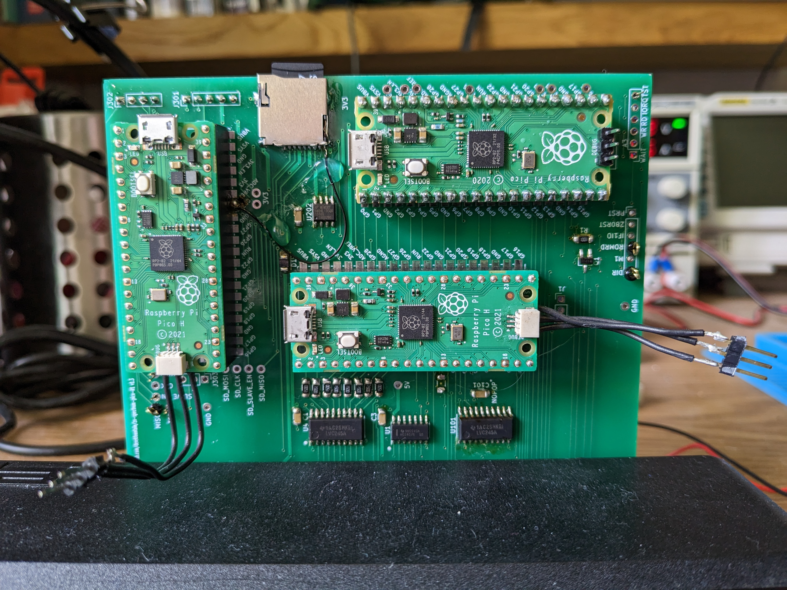
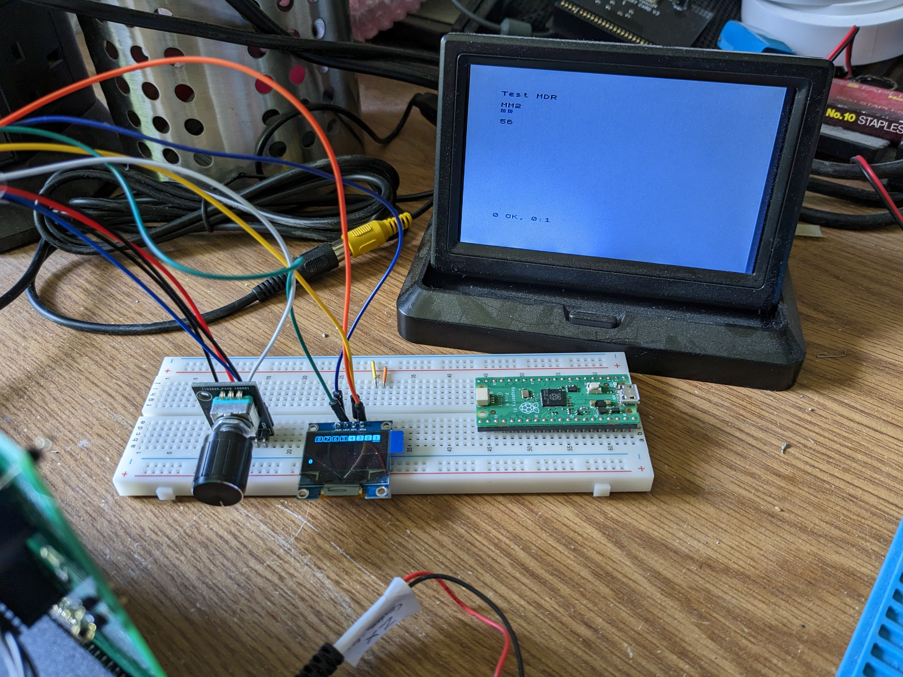

# zx-spectrum-if1-emulator

## An Interface One / Microdrive Emulation for the ZX Spectrum

This device plugs into the back of a 48K ZX Spectrum and provides the
functionality of the original 1984 "ZX Spectrum Expansion System". It
emulates a ZX Interface One with 8 ZX Microdrives.

The goal is total compatibility with all 1980s software with no ROM
modifications or other hacks.

The first version will support the ZX Microdrives; RS232 and ZX Net
might follow.

Open source, open hardware design.

## Status

As of July 2023 the hardware design is on the second prototype. It looks like
this:

Yes, it's enormous, but I'm currently working with the hardware all the
time and having it this big means it's easier to get the soldering iron
between the components.

The third prototype, which ideally would be the final hardware design
but in practise will probably be the penultimate one, is currently being
fabricated. It's much smaller than the second prototype pictured and has
a lay-flat design and rear throughport edge connector.

The user interface is now built in to the unit and is as complete as it's
likely to get for the time being. As per the prototype photo below it
consists of an OLED screen, a rotary encoder and 2 input buttons. There
are now 8 individual LEDs to match the 8 microdrive motor LEDs.

The hardware and software are now working:

* Spectrum can read and write all 8 microdrives
* Uses "MDR" image format for "cartridges", fully compatible with emulators
* Full ZX Interface One ROM support, all native BASIC commands and extensions work as designed
* Bug for bug compatible
* MDR files loaded from, and saved back to, SD card
* User interface uses file selector to choose and "insert" a cartridge
* Cartridge eject works, allowing cartridges to be changed as required
* Configuration file allows auto-insertion of selected cartridges at start up

The project remains a work in progress, but is approaching completion.

Derek Fountain, July 2023
